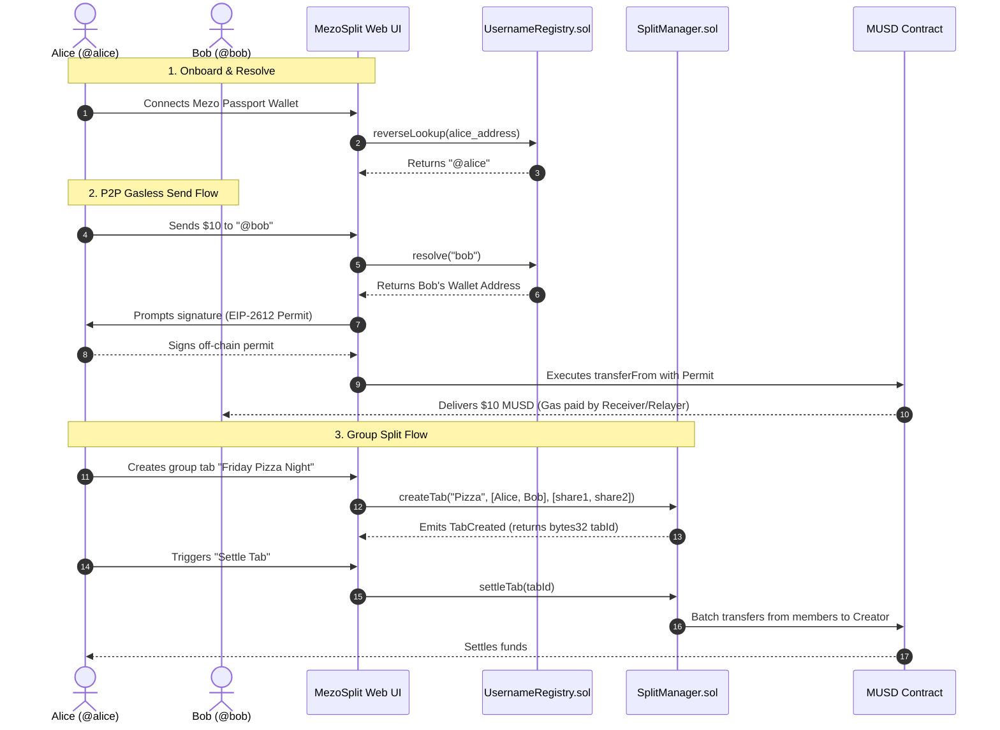

# ⚖️ MezoPay

**MezoPay** is a decentralized, gasless, peer-to-peer payment and bill-splitting platform built on **Mezo** primitives. It functions like a Web3 version of Venmo, allowing users to register case-insensitive @handles, send gasless MUSD stablecoins via EIP-2612 `permit2` signatures, and split group tabs natively in a single on-chain transaction.

---

## 🚀 Key Features

*   **Custom Profiles (@Usernames)**: Claim a unique, case-insensitive on-chain profile handle mapped 1-to-1 to your wallet via our `UsernameRegistry` contract.
*   **Gasless MUSD Transfers**: Send payments directly to handles. Under the hood, MezoSplit leverages EIP-2612 signatures — the sender signs a transaction off-chain, and the receiver pays zero gas.
*   **On-Chain Bill Splitting**: Create group tabs, calculate splits, and batch-settle balances in a single transaction with the `SplitManager` contract.
*   **Rich SEO & Custom Sharing**: Dynamic sitemaps, rich Open Graph metadata, and optimized sharing configurations for social links.

---

## 🗺️ System Architecture

Below is the interaction flow between the Frontend app, Mezo Passport, and our deployed smart contracts:



---

## 📍 Smart Contract Configurations

The contracts are deployed on the **Mezo Testnet (Chain ID: 31611)**:

*   **MUSD (Testnet Token)**: [`0x118917a40FAF1CD7a13dB0Ef56C86De7973Ac503`](https://explorer.test.mezo.org/token/0x118917a40FAF1CD7a13dB0Ef56C86De7973Ac503)
*   **UsernameRegistry**: [`0x8eB4E69A550Dc63BaB674469eBC516d893793de8`](https://explorer.test.mezo.org/address/0x8eB4E69A550Dc63BaB674469eBC516d893793de8#code) *(Fully Verified)*
*   **SplitManager**: [`0x9cd6D4A92939A1b93fBb3c848c2cF3e9f09D4C10`](https://explorer.test.mezo.org/address/0x9cd6D4A92939A1b93fBb3c848c2cF3e9f09D4C10#code) *(Fully Verified)*

---

## 🛠️ Local Installation & Development

### Prerequisite: Node.js (v18+)

1.  **Clone the Repository**:
    ```bash
    git clone https://github.com/your-username/mezo-split.git
    cd mezo-split
    ```

2.  **Install Web App Dependencies**:
    ```bash
    npm install
    ```

3.  **Run Development Server**:
    ```bash
    npm run dev
    ```
    Open `http://localhost:3000` to interact with the P2P payment dashboard.

### Managing Smart Contracts
The Solidity code and Hardhat compiler setups are located in `contracts/`:
```bash
cd contracts
npm install
npx hardhat compile
```

---

## ☁️ Deploying on Vercel

MezoPay is designed to be easily deployable on **Vercel** with Next.js optimization.

### Step 1: Connect to Vercel
1. Log in to your [Vercel Dashboard](https://vercel.com).
2. Click **New Project** and import your Git Repository.

### Step 2: Configure Environment Variables
Add the following key-value pairs in the **Environment Variables** section on Vercel:
*   `NEXT_PUBLIC_REGISTRY`: `0x8eB4E69A550Dc63BaB674469eBC516d893793de8` (UsernameRegistry address)
*   `NEXT_PUBLIC_SPLIT`: `0x9cd6D4A92939A1b93fBb3c848c2cF3e9f09D4C10` (SplitManager address)

### Step 3: Deploy
Click **Deploy**. Vercel will automatically build the Next.js production site, compile metadata sitemaps, and serve your app globally.

---

## 🔗 Connect & Links

*   **Official X**: [https://x.com/GetMezoPay](https://x.com/GetMezoPay)
*   **Documentation**: [Mezo Developer Docs](https://mezo.org/docs/developers/)
*   **Explorer**: [Mezo Explorer](https://explorer.test.mezo.org)
