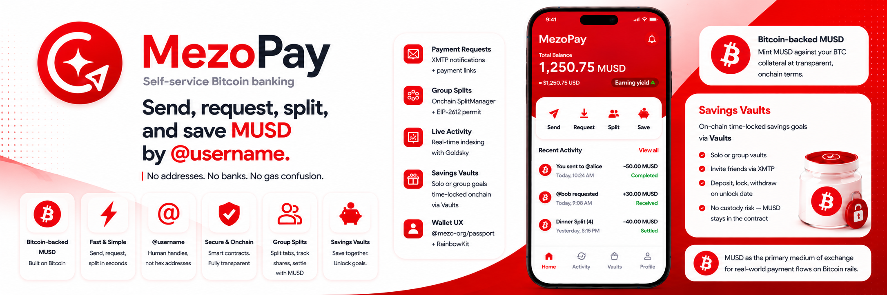
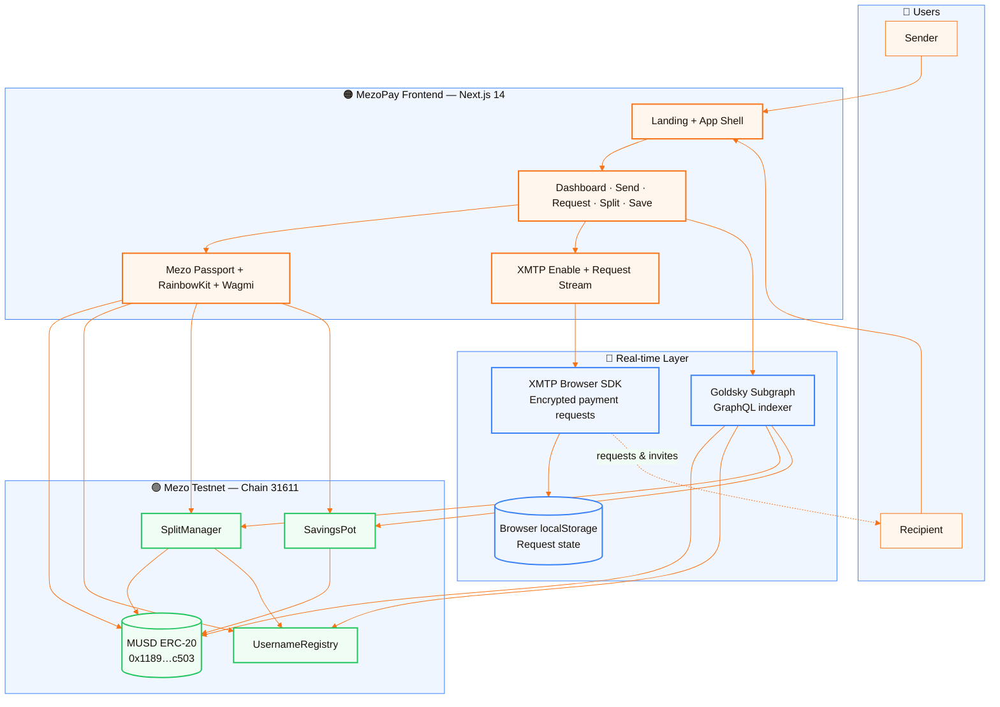

<div align="center">



# MezoPay

**Self-service Bitcoin banking — send, request, split, and save MUSD by @username. No addresses, no banks, no gas confusion.**

[](https://mezo.org)
[-22C55E?style=for-the-badge)](https://supernormal.foundation)
[](https://mezo.org/docs/developers/musd)
[](https://explorer.test.mezo.org)
[](https://nextjs.org)
[](https://www.typescriptlang.org)
[](https://xmtp.org)
[](LICENSE)

[Live Demo](https://mezopay.nikhilraikwar.me) · [Architecture](#architecture) · [Contracts](./contracts/README.md) · [Roadmap](./ROADMAP.md) · [Mezo Docs](https://mezo.org/docs/developers/) · [Supernormal](https://supernormal.foundation)

</div>

---

## Overview

**MezoPay** is a consumer payments app built for the **Supernormal dApps — MUSD Track** at the Mezo hackathon. It turns Bitcoin-backed **MUSD** into something people actually use: pay a friend, request dinner money, split a group tab, or save toward a goal — all with `@username`, not hex addresses.

Users can seamlessly obtain MUSD — Mezo's native Bitcoin-backed stablecoin — directly on the Mezo portal. MezoPay then sits on top as the consumer banking layer: the full Venmo/Cash App experience, running entirely on Bitcoin rails.

> **Hackathon tracks:** Supernormal dApps (MUSD) + Bank on Bitcoin. Every flow settles in MUSD on Mezo Testnet (Chain 31611). No fiat, no centralised custody, no selling BTC.

---

## Team

| Member | Role |
|---|---|
| **Nikhil Raikwar** | **Project Creator & Lead.** Full-stack development, smart contract engineering (Solidity/Foundry), system architecture, UI/UX design, XMTP integration, Goldsky subgraph, deployment infrastructure. The entire codebase, product concept, and technical vision originate from Nikhil. |
| **Shivam Soni** | PPT presentation design and website marketing content / headline copy. |

---

## Why Mezo + MUSD

| Mezo principle | How MezoPay applies it |
|---|---|
| Bitcoin-backed stablecoin | All flows settle in **MUSD** on Mezo testnet — zero fiat |
| User-controlled, onchain | Transfers & splits via smart contracts; every position auditable on explorer |
| Productive capital | Savings Pots lock MUSD toward goals; Mezo Earn yield narrative in dashboard |
| No selling BTC | Spend, split, and request in MUSD while keeping BTC exposure via Mezo's model |
| Superdapp vision | Payments + group splits + savings pots + virtual card = full self-service Bitcoin banking |

---

## Features

| Feature | Description |
|---|---|
| **Quick Send** | Send MUSD to `@username` via onchain `transfer` — receiver pays zero gas (EIP-2612) |
| **Payment Requests** | Request MUSD with **XMTP v7** encrypted notifications, or share a payment link fallback |
| **Group Split Tabs** | Onchain `SplitManager` — create tabs, track shares, settle with MUSD (`payShare` + `settleWithPermit`) |
| **@Username Registry** | `UsernameRegistry.sol` maps handles → wallets (3–20 chars, lowercase, case-insensitive) |
| **Live Activity Feed** | Goldsky subgraph indexes all transfers, tabs, pots, and registry events in real time |
| **Savings Pots** | `SavingsPot.sol` — solo time-locked MUSD savings goals with 5% early-withdrawal penalty |
| **XMTP Invites** | Split and pot invites sent as encrypted XMTP messages; recipients see real-time popups |
| **Virtual Card (Demo)** | Interactive debit card UI with freeze toggle, reveal details, and spending limit slider |
| **Friends & Contacts** | Auto-built from on-chain history with live owed/owing balances |
| **Wallet UX** | [@mezo-org/passport](https://www.npmjs.com/package/@mezo-org/passport) + RainbowKit — email/social-friendly onboarding |

---

## Architecture



---

## Key Technical Highlights

### 1. Zero Hex Addresses in the UI
The `UsernameRegistry.sol` contract (deployed on Mezo Testnet) provides `resolve(username)` → address and `reverseLookup(address)` → username. Every part of the app — from send forms to history entries to friend lists — resolves and displays `@username`. Raw `0x...` addresses are hidden completely from the user.

### 2. Encrypted P2P Payment Requests via XMTP
When a user requests money, zero on-chain state is written. Instead, a JSON payload is sent as an encrypted XMTP v7 (MLS) message to the recipient's wallet. The recipient's app streams incoming messages and surfaces them as real-time popup notifications with a single-tap Pay button.

### 3. On-Chain Group Bill Splitting
`SplitManager.sol` creates a group tab with title, member addresses, and per-member share amounts. Members call `payShare()` (or `settleWithPermit()` for the gasless EIP-2612 path) to pay their share. The creator calls `settleTab()` to pull all remaining shares at once via `transferFrom`. XMTP invites are sent to all members at tab creation time.

### 4. Gamified Savings with Penalty Economics
`SavingsPot.sol` enforces a hard `unlockTime` on deposits. Early withdrawal before the unlock time incurs a 5% penalty routed to the pot creator. This creates real on-chain savings discipline. `creatorUnlock()` lets the creator release all members penalty-free when the goal is met.

### 5. Real-Time History Without RPC Polling
A Goldsky subgraph on Mezo Testnet indexes all MUSD `Transfer` events, `TabCreated/Settled/MemberPaid`, `PotCreated/Deposited/Withdrawn`, and `UsernameRegistered/Released`. The frontend fires a single GraphQL query on mount and gets the full sorted history in milliseconds — no slow `eth_getLogs` polling.

### 6. Optimistic Rendering
XMTP requests and local tab state are shown immediately without waiting for block confirmations, giving the app a Web2 feel while remaining fully on-chain under the hood.

---

## Smart Contracts

| Contract | Address | Description |
|---|---|---|
| MUSD (official testnet) | [`0x118917a40FAF1CD7a13dB0Ef56C86De7973Ac503`](https://explorer.test.mezo.org/address/0x118917a40FAF1CD7a13dB0Ef56C86De7973Ac503) | Bitcoin-backed stablecoin, EIP-2612 |
| UsernameRegistry | [`0x8eB4E69A550Dc63BaB674469eBC516d893793de8`](https://explorer.test.mezo.org/address/0x8eB4E69A550Dc63BaB674469eBC516d893793de8) | @handle → wallet mapping |
| SplitManager | [`0x11B5B5058C85CB446e4d68765B24661Da58BE83A`](https://explorer.test.mezo.org/address/0x11B5B5058C85CB446e4d68765B24661Da58BE83A) | Group bill splitting |
| SavingsPot | [`0xCEB877c8dD2f67A77353790d961Ee56fF7F1a4e4`](https://explorer.test.mezo.org/address/0xCEB877c8dD2f67A77353790d961Ee56fF7F1a4e4) | Time-locked savings goals |

---

## Tech Stack

| Layer | Technology |
|---|---|
| Frontend | Next.js 14, React 18, TypeScript, Tailwind CSS 4 |
| Wallet | Wagmi 2, Viem, RainbowKit, `@mezo-org/passport` |
| Messaging | `@xmtp/browser-sdk` v7 (MLS, opt-in enable + silent resume) |
| Indexing | Goldsky subgraph (`mezopay` on `mezo-testnet`) |
| Contracts | Solidity 0.8.28, Foundry, OpenZeppelin 5.x |
| Fonts | DM Sans, Syne (Google Fonts) |
| Deployment | Vercel (frontend) |

---

## Repository Layout

```
apps/web/
├── app/                 # Next.js App Router (landing + /app/*)
│   ├── dashboard/       # Balance cards, quick send/request/split
│   ├── send/            # P2P MUSD transfer
│   ├── request/         # XMTP payment requests + pending inbox
│   ├── split/           # Group tab creation + active tabs
│   ├── earn/            # Savings pots creation + management
│   ├── card/            # Virtual card UI (demo)
│   ├── history/         # Full transaction history (Goldsky)
│   ├── friends/         # Contacts with live balances
│   └── settings/        # @username claim + wallet info
├── components/          # Wallet providers, ConnectWallet
├── contracts/           # Foundry — UsernameRegistry, SplitManager, SavingsPot
├── lib/                 # ABIs, XMTP helpers, request storage utils
├── subgraph/            # Goldsky / The Graph schema + mappings
└── public/              # Banner, favicon
```

---

## Quick Start

### Prerequisites

- Node.js 20+
- A [WalletConnect](https://cloud.reown.com) project ID (allowlist `http://localhost:3000` and your deploy URL)
- Mezo testnet MUSD from the [faucet](https://faucet.test.mezo.org)

### 1. Install & Configure

```bash
npm install
cp .env.example .env.local
```

Open `.env.local` and set at least `NEXT_PUBLIC_WALLETCONNECT_PROJECT_ID`. The `NEXT_PUBLIC_GOLDSKY_URL` is already pre-configured to our live Goldsky deployment — no need to run your own indexer.

### 2. Run the App

```bash
npm run dev
```

Open [http://localhost:3000](http://localhost:3000) → Connect wallet → Go to **Settings** → Register your `@username` → Enable **XMTP Notifications** in the sidebar (one-time MetaMask signature).

### 3. Deploy Contracts (Optional)

See [contracts/README.md](./contracts/README.md).

---

## Testnet Deployment

| Resource | URL |
|---|---|
| **Live App** | https://mezopay.nikhilraikwar.me |
| **RPC** | `https://rpc.test.mezo.org` |
| **Chain ID** | `31611` |
| **Explorer** | [explorer.test.mezo.org](https://explorer.test.mezo.org) |
| **Faucet** | [faucet.test.mezo.org](https://faucet.test.mezo.org) |
| **Goldsky GraphQL** | [mezosplit v5 API](https://api.goldsky.com/api/public/project_cmpauvflbxl4l01tgc2cgakep/subgraphs/mezosplit/v5/gn) |

---

## Roadmap

See **[ROADMAP.md](./ROADMAP.md)** for the full phased product plan with Mermaid architecture diagrams.

**Summary:**
- **Phase 1 (Q3 2026)** — Mainnet deployment, full EIP-2612 permit path, Mezo Earn integration, group pots GA
- **Phase 2 (Q4 2026)** — Marqeta virtual card program, merchant POS SDK, subscription billing
- **Phase 3 (Q1–Q2 2027)** — React Native mobile app, fiat off-ramp, auto-pay for savings
- **Phase 4 (Q3 2027)** — Creator tipping, merchant marketplace, open SDK

---

## Useful Links

- [Mezo Documentation](https://mezo.org/docs/developers/)
- [What is MUSD?](https://mezo.org/docs/developers/musd)
- [Introducing Mezo Earn](https://mezo.org/docs/developers/earn)
- [Mezo GitHub](https://github.com/mezo-org)
- [@mezo-org/passport on npm](https://www.npmjs.com/package/@mezo-org/passport)
- [Supernormal Foundation](https://supernormal.foundation)
- [XMTP Docs](https://docs.xmtp.org)
- [Goldsky Docs](https://docs.goldsky.com)

---

## License & Credits

Built for the **Mezo × Supernormal** hackathon — original work developed during the event.

**Created by Nikhil Raikwar** — full product concept, architecture, smart contracts, frontend, XMTP integration, and Goldsky subgraph.

Presentation design and website headline content by Shivam Soni.

MIT © 2026 MezoPay Contributors — see [LICENSE](LICENSE).

---

<div align="center">

**Bitcoin should feel as normal as using your phone. MezoPay is a step toward that with MUSD.**

</div>
