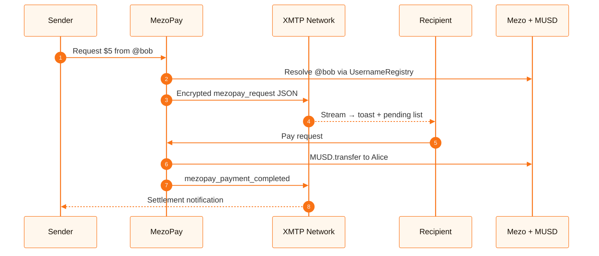
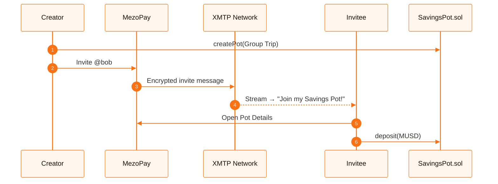

<div align="center">

# MezoPay

**Self-service Bitcoin banking — send, request, split, and save MUSD by @username. No addresses, no banks, no gas confusion.**

[](https://mezo.org)
[-22C55E?style=for-the-badge)](https://supernormal.foundation)
[](https://mezo.org/docs/developers/musd)
[](https://explorer.test.mezo.org)
[](https://nextjs.org)
[](https://www.typescriptlang.org)
[](https://xmtp.org)
[](LICENSE)

[Live Demo](#-quick-start) · [Architecture](#-architecture) · [Contracts](./contracts/README.md) · [Mezo Docs](https://mezo.org/docs/developers/) · [Supernormal](https://supernormal.foundation)

</div>

---

## Overview

**MezoPay** is a consumer payments app built for the **Supernormal dApps — MUSD Track** at the Mezo hackathon. It turns Bitcoin-backed **MUSD** into something people actually use: pay a friend, request dinner money, or split a group tab — all with `@username`, not hex addresses.

Mezo lets Bitcoin holders mint MUSD against BTC collateral at transparent, onchain terms. MezoPay sits on top as the consumer banking layer: send to @username, split group bills, and save toward goals — all in MUSD, all on Bitcoin rails.

> **Hackathon focus:** Self-service banking on Bitcoin rails — MUSD as the primary medium of exchange for real-world payment flows (P2P send, requests, splits, merchant-ready primitives).

---

## Why Mezo + MUSD

| Mezo principle | How MezoPay applies it |
|----------------|------------------------|
| Bitcoin-backed stablecoin | All flows settle in **MUSD** on Mezo testnet |
| User-controlled, onchain | Transfers & splits via smart contracts; positions auditable on explorer |
| Productive capital | Dashboard surfaces live yield accrual (Mezo Earn narrative) |
| No selling BTC | Spend/split/request in MUSD while keeping BTC exposure via Mezo’s model |
| Superdapp vision | Payments + group splits + savings pots = full self-service Bitcoin banking |

---

## Features

| Feature | Description |
|---------|-------------|
| **Quick Send** | Send MUSD to `@username` or `0x` address via onchain `transfer` |
| **Payment Requests** | Request MUSD with **XMTP** instant notifications, or share a payment link fallback |
| **Group Split Tabs** | Onchain `SplitManager` — create tabs, track shares, settle with MUSD (+ EIP-2612 permit path) |
| **@username Registry** | `UsernameRegistry.sol` maps handles → wallets (3–20 chars, lowercase) |
| **Live Activity** | Goldsky subgraph indexes transfers, tabs, and registry events |
| **Savings Pots** | SavingsPot.sol — solo or group time-locked MUSD savings goals. XMTP invites for group coordination. Deposit, lock, withdraw on unlock date. |
| **Wallet UX** | [@mezo-org/passport](https://www.npmjs.com/package/@mezo-org/passport) + RainbowKit — email/social-friendly onboarding |

---

## Savings Pots

On-chain time-locked savings goals via `SavingsPot.sol`:
- **Solo pots** — personal goals (house deposit, trip fund) with configurable lock duration
- **Group pots** — invite friends via XMTP, everyone deposits their share, time lock enforced on-chain
- **No custody risk** — MUSD stays in the contract, not with any intermediary
- Deployed at `0x72290EB00a06c4a5582c64e8E336F6e4D242bE87` on Mezo testnet

---

## Architecture


### XMTP Notification Flows

#### 1. Payment Requests


#### 2. Savings Pot Invites


---

## Tech stack

| Layer | Technology |
|-------|------------|
| Frontend | Next.js 14, React 18, TypeScript, Tailwind CSS 4 |
| Wallet | Wagmi 2, Viem, RainbowKit, `@mezo-org/passport` |
| Messaging | `@xmtp/browser-sdk` v7 (MLS, opt-in enable + silent resume) |
| Indexing | Goldsky subgraph (`mezopay` on `mezo-testnet`) |
| Contracts | Solidity 0.8.28, Foundry, OpenZeppelin (see [contracts/README.md](./contracts/README.md)) |

---

## Repository layout

```
apps/web/
├── app/                 # Next.js App Router (landing + /app/*)
├── components/          # Wallet providers, ConnectWallet
├── contracts/           # Foundry — UsernameRegistry, SplitManager
├── lib/                 # ABIs, XMTP helpers, request storage
├── subgraph/            # Goldsky / The Graph mappings
└── public/
```

---

## Quick start

### Prerequisites

- Node.js 20+
- A [WalletConnect](https://cloud.reown.com) project ID (allowlist `http://localhost:3000` and your deploy URL)
- Mezo testnet MUSD ([faucet](https://faucet.test.mezo.org))

### 1. Install & configure

```bash
npm install
cp .env.example .env.local
```

Open `.env.local` and set at least `NEXT_PUBLIC_WALLETCONNECT_PROJECT_ID`. The `NEXT_PUBLIC_GOLDSKY_URL` is already pre-configured to point to our live Goldsky deployment, so you don't need to deploy your own indexer. See [`.env.example`](.env.example) for all variables and comments.

### 2. Run the app

```bash
npm run dev
```

Open [http://localhost:3000](http://localhost:3000) → connect wallet → enable **XMTP Notifications** in the sidebar (one-time MetaMask signature).

### 3. Deploy contracts (optional)

See [contracts/README.md](./contracts/README.md).

---

## Testnet deployment

| Resource | URL |
|----------|-----|
| RPC | `https://rpc.test.mezo.org` |
| Chain ID | `31611` |
| Explorer | [explorer.test.mezo.org](https://explorer.test.mezo.org) |
| Faucet | [faucet.test.mezo.org](https://faucet.test.mezo.org) |

| Contract | Address |
|----------|---------|
| MUSD (official testnet) | `0x118917a40FAF1CD7a13dB0Ef56C86De7973Ac503` |
| UsernameRegistry | `0x8eB4E69A550Dc63BaB674469eBC516d893793de8` |
| SplitManager | `0x9cd6D4A92939A1b93fBb3c848c2cF3e9f09D4C10` |

---

## Useful links

- [Mezo Documentation](https://mezo.org/docs/developers/)
- [What is MUSD?](https://mezo.org/docs/developers/musd)
- [Introducing Mezo Earn](https://mezo.org/docs/developers/earn)
- [Mezo GitHub](https://github.com/mezo-org)
- [@mezo-org/passport on npm](https://www.npmjs.com/package/@mezo-org/passport)
- [Supernormal Foundation](https://supernormal.foundation)
- [XMTP Docs](https://docs.xmtp.org)

---

## Team & license

Built for the **Mezo × Supernormal** hackathon — original work developed during the event.

MIT © 2026 MezoPay Contributors — see [LICENSE](LICENSE).

---

<div align="center">

**Bitcoin should feel as normal as using your phone. MezoPay is a step toward that with MUSD.**

</div>
