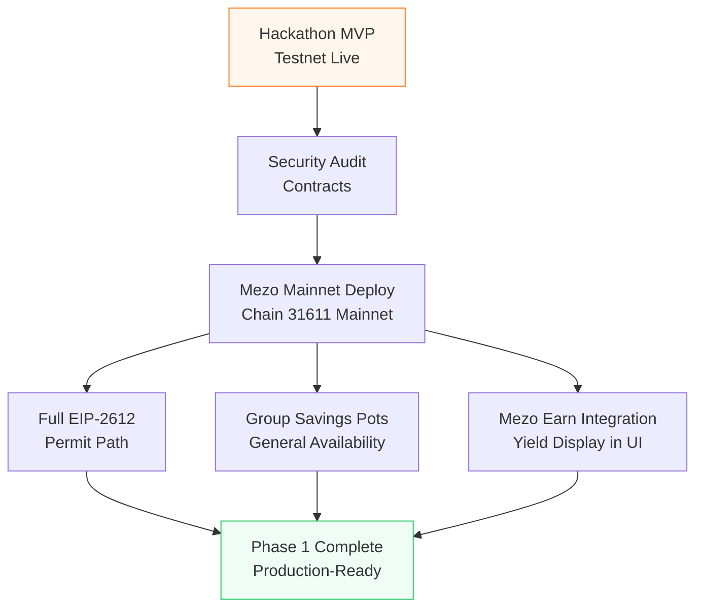
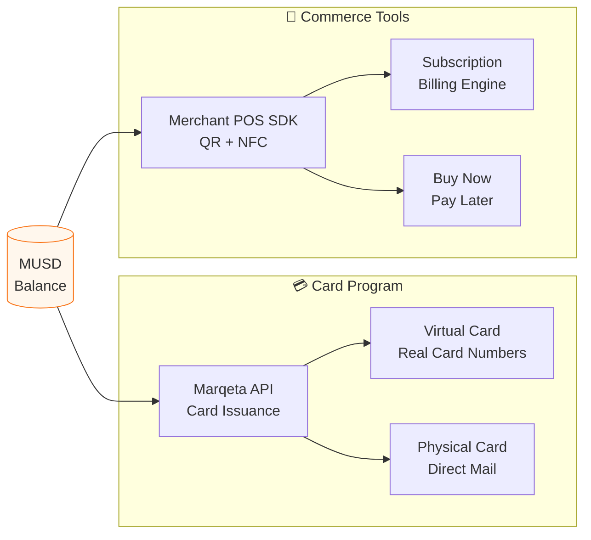
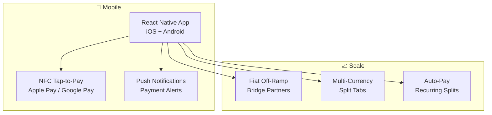
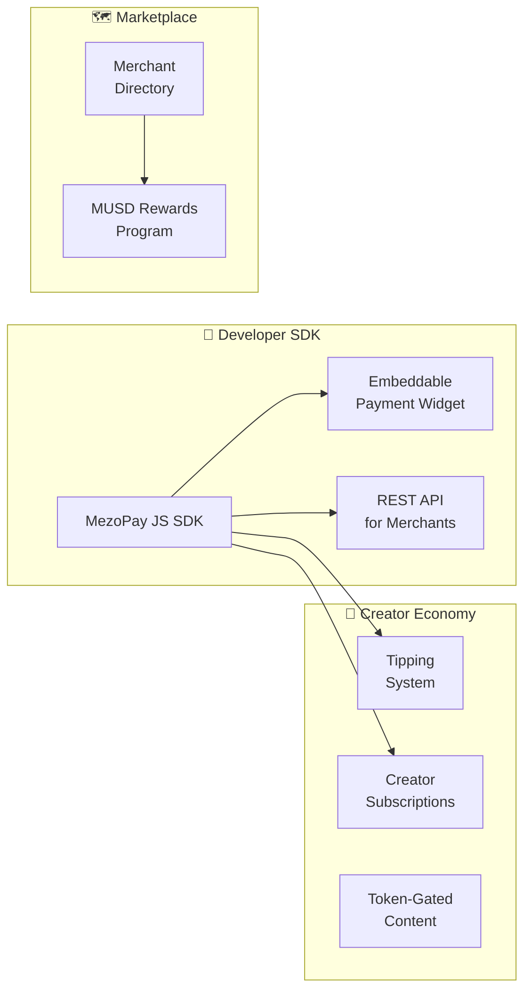
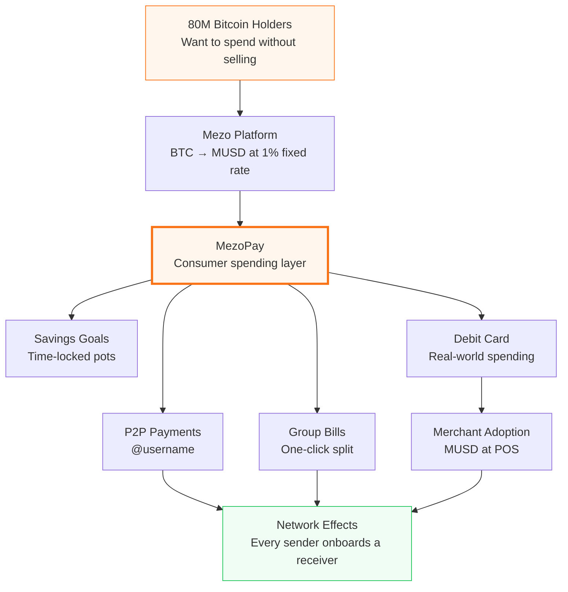

# MezoPay — Product Roadmap

> **Vision:** Make Bitcoin-backed MUSD as natural as tapping your phone to pay. MezoPay is the consumer banking layer on Mezo — where every payment, split, and saving goal runs on Bitcoin rails without the complexity.

---

## Current State (Hackathon MVP — May 2026)

All features below are **live on Mezo Testnet (Chain 31611)**.

| Feature | Status |
|---|---|
| @Username Registry (`UsernameRegistry.sol`) | ✅ Live |
| P2P MUSD Send | ✅ Live |
| Encrypted Payment Requests (XMTP v7) | ✅ Live |
| Group Split Tabs (`SplitManager.sol`) | ✅ Live |
| Savings Pots — Solo (`SavingsPot.sol`) | ✅ Live |
| Goldsky Real-Time Activity Feed | ✅ Live |
| Virtual Card Demo UI | ✅ Live (UI only) |
| Friends & Contacts (auto from on-chain) | ✅ Live |
| Mobile Responsive Design | ✅ Live |

---

## Roadmap Overview

---

## Phase 1 — Mainnet Foundation
**Target: Q3 2026**

The bridge from testnet demo to production-grade, user-facing product.

### Milestones

**M1.1 — Contract Security Audit**
- Engage Trail of Bits / Sherlock for SplitManager.sol, SavingsPot.sol, UsernameRegistry.sol
- Fix any critical/high findings
- Publish audit report publicly

**M1.2 — Mezo Mainnet Deployment**
- Deploy all three contracts to Mezo Mainnet
- Update Goldsky subgraph to mainnet chain
- Update frontend environment to point at mainnet
- Maintain testnet environment for developer testing

**M1.3 — Full EIP-2612 Permit Path**
- Complete gasless `settleWithPermit` flow in SplitManager
- Users never see an "Approve" transaction — single-signature settlement
- Frontend detects permit support and uses it automatically

**M1.4 — Group Savings Pots GA**
- Fully enable group pot creation flow in UI (currently "Coming Soon")
- Multi-member deposit tracking
- XMTP group invite with pot details and deep link

**M1.5 — Mezo Earn Yield Display**
- Connect to Mezo Earn API/contract
- Show live yield accruing on MUSD balance in dashboard
- "Your MUSD is working" narrative in UI

---

## Phase 2 — Card & Commerce
**Target: Q4 2026**

Transform MezoPay into a real spending instrument usable at physical and online merchants.

### Milestones

**M2.1 — Marqeta Virtual Card Program**
- Integrate Marqeta card-issuing API
- Issue real Mastercard/Visa virtual card numbers backed by MUSD balance
- Freeze/unfreeze, spending limits, transaction notifications
- Compliance: KYC for card issuance (Persona or Stripe Identity)

**M2.2 — Merchant POS SDK**
- JavaScript SDK for merchants to accept MUSD
- QR code + NFC tap-to-pay flow
- Settlement in MUSD to merchant wallet
- Dashboard for merchant transaction history

**M2.3 — Subscription Billing Module**
- Recurring payment smart contract with time-based pull mechanism
- Creator or merchant sets up subscription plans
- User approves once; contract pulls MUSD monthly/weekly
- Cancel any time; instant on-chain

**M2.4 — Buy Now Pay Later**
- BNPL contract: user pays 25% now, rest split over 3 months
- Backed by MUSD collateral locked in contract
- Integrates with merchant POS SDK

---

## Phase 3 — Mobile & Scale
**Target: Q1–Q2 2027**

Meet users where they are: on their phones, in the real world.

### Milestones

**M3.1 — React Native Mobile App**
- iOS + Android app using Expo
- Full feature parity with web app
- Biometric authentication
- Deep links for payment requests and split invitations

**M3.2 — Fiat Off-Ramp**
- Partner with bridge providers (e.g., Transak, MoonPay, Layerswap)
- MUSD → bank account or debit card
- In-app off-ramp flow with KYC

**M3.3 — Multi-Currency Split Tabs**
- Input expense in any fiat currency (USD, EUR, INR, etc.)
- Auto-convert to MUSD equivalent at settlement
- Price feed via Chainlink or Pyth oracle

**M3.4 — Recurring Payments / Auto-Pay for Pots**
- Schedule regular MUSD deposits into Savings Pots
- Linked to on-chain calendar contract or keeper network (Chainlink Automation)
- "Save $50 MUSD every week toward my Japan trip"

---

## Phase 4 — Ecosystem & SDK
**Target: Q3 2027**

Open MezoPay's infrastructure to third-party builders and expand into creator/social economy.

### Milestones

**M4.1 — Creator Tipping & Subscriptions**
- One-click MUSD tip button embeddable on any website
- Creator subscription tiers with XMTP-gated content delivery
- Revenue dashboard for creators

**M4.2 — Merchant Marketplace Directory**
- In-app directory of MUSD-accepting merchants
- Merchant profiles, categories, reviews
- MUSD cashback/rewards for transactions at participating merchants

**M4.3 — MezoPay SDK**
- Open-source JavaScript SDK
- Embeddable payment widget (`<MezoPayButton />`)
- REST API for server-side payment verification
- Documentation site at `docs.mezopay.app`

---

## Success Metrics by Phase

| Phase | Key Metric | Target |
|---|---|---|
| Phase 1 | Mainnet wallets registered | 1,000 @usernames |
| Phase 1 | MUSD volume processed | $50,000 |
| Phase 2 | Virtual cards issued | 500 |
| Phase 2 | Merchants onboarded | 50 |
| Phase 3 | Mobile app downloads | 5,000 |
| Phase 3 | Monthly active users | 1,000 |
| Phase 4 | SDK integrations | 20 |
| Phase 4 | Creator accounts | 200 |

---

## Why MezoPay Will Scale

The flywheel is simple: every time someone splits a bill with MezoPay, every non-user member gets onboarded. Every card tap at a merchant proves MUSD is real money. Every savings pot creates a long-term, sticky MUSD holder. This is how Bitcoin becomes normal.

---

## Alignment with Mezo's Mission

| Mezo Principle | MezoPay Implementation |
|---|---|
| Bitcoin should be productive capital | MUSD never sits idle — it's splitting bills, locked in pots, earning yield |
| No selling BTC | All flows denominated in MUSD; BTC collateral untouched |
| User-controlled, onchain | Every balance auditable on `explorer.test.mezo.org` |
| Self-service banking | No banks, no intermediaries, no permission needed |
| Superdapp vision | Payments + splits + savings + card = full banking stack |

---

*MezoPay is original work developed during the Mezo × Supernormal hackathon by Nikhil Raikwar.*
*MIT © 2026 MezoPay Contributors*
