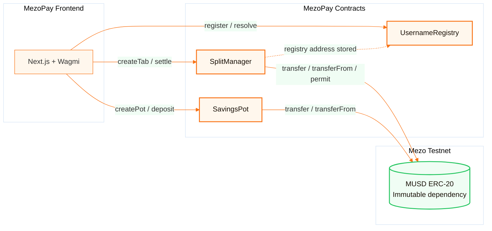
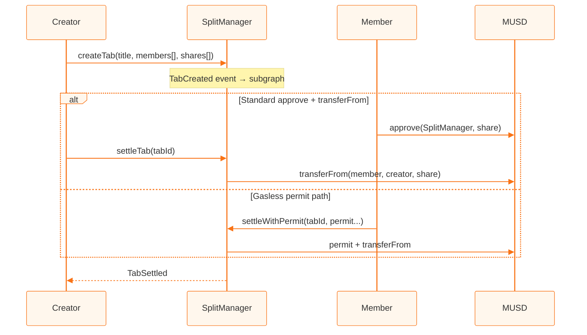

<div align="center">

# MezoPay — Smart Contracts

**Onchain MUSD payment primitives for Mezo testnet (Chain 31611)**

[](https://soliditylang.org)
[](https://book.getfoundry.sh)
[](https://mezo.org)
[](https://mezo.org/docs/developers/musd)
[](https://openzeppelin.com/contracts)
[](../LICENSE)

[Deploy](#deployment) · [Architecture](#architecture) · [Frontend README](../README.md)

</div>

---

## Overview

These contracts power **MezoPay**’s hackathon MVP on **Mezo testnet**:

1. **`UsernameRegistry`** — Maps `@username` → wallet so the app never forces raw addresses on users.
2. **`SplitManager`** — Group expense tabs settled in **MUSD**, with optional **EIP-2612 permit** gasless-style approvals.
3. **`SavingsPot`** — Time-locked savings goals (solo or group) enforcing strict on-chain discipline.

Both integrate the official testnet **MUSD** token — satisfying the hackathon requirement to build on **MUSD** for the Supernormal dApps track.

---

## Architecture



### Settlement paths



---

## Contracts

### `UsernameRegistry.sol`

| Function | Description |
|----------|-------------|
| `register(username)` | Claim a unique handle (3–20 chars, `a-z`, `0-9`, `_`) |
| `release()` | Give up your username |
| `resolve(username)` | Username → address |
| `reverseLookup(wallet)` | Address → username |
| `isAvailable(username)` | Check availability |

**Events:** `UsernameRegistered`, `UsernameReleased`

### `SplitManager.sol`

| Function | Description |
|----------|-------------|
| `createTab(title, members, shares)` | Create a group tab; returns `tabId` |
| `settleTab(tabId)` | Creator pulls MUSD from unpaid members (allowance required) |
| `settleWithPermit(...)` | Member pays share via EIP-2612 permit signature |
| `getTab` / `hasPaid` / `getUserTabs` | Views for frontend + indexer |

**Constructor:** `SplitManager(address musd, address registry)`

**Events:** `TabCreated`, `MemberPaid`, `TabSettled`

### `SavingsPot.sol`

| Function | Description |
|----------|-------------|
| `createPot(target, lockTime)` | Create a savings goal pot with a strict unlock timestamp |
| `deposit(potId, amount)` | Deposit MUSD into the pot (locked until time passes) |
| `withdraw(potId)` | Withdraw MUSD after the unlock time has elapsed |

**Constructor:** `SavingsPot(address musd)`

**Events:** `PotCreated`, `Deposited`, `Withdrawn`

---

## Deployed addresses (testnet)

| Contract | Address |
|----------|---------|
| MUSD (Mezo official) | [`0x118917a40FAF1CD7a13dB0Ef56C86De7973Ac503`](https://explorer.test.mezo.org/address/0x118917a40FAF1CD7a13dB0Ef56C86De7973Ac503) |
| UsernameRegistry | [`0x8eB4E69A550Dc63BaB674469eBC516d893793de8`](https://explorer.test.mezo.org/address/0x8eB4E69A550Dc63BaB674469eBC516d893793de8) |
| SplitManager | [`0x9cd6D4A92939A1b93fBb3c848c2cF3e9f09D4C10`](https://explorer.test.mezo.org/address/0x9cd6D4A92939A1b93fBb3c848c2cF3e9f09D4C10) |
| SavingsPot | [`0x72290EB00a06c4a5582c64e8E336F6e4D242bE87`](https://explorer.test.mezo.org/address/0x72290EB00a06c4a5582c64e8E336F6e4D242bE87) |

---

## Development

### Prerequisites

- [Foundry](https://book.getfoundry.sh/getting-started/installation)
- `PRIVATE_KEY` with Mezo testnet ETH for gas

### Install dependencies

```bash
cd contracts
forge install foundry-rs/forge-std --no-commit
npm install
```

### Build & test

```bash
forge build
forge test -vv
```

### Deployment

```bash
export PRIVATE_KEY=0x...
forge script script/Deploy.s.sol:Deploy \
  --rpc-url mezotestnet \
  --broadcast \
  -vvvv
```

`Deploy.s.sol` deploys:

1. `UsernameRegistry`
2. `SplitManager(MUSD_TESTNET, registry)`
3. `SavingsPot(MUSD_TESTNET)`

Update frontend env vars:

```env
NEXT_PUBLIC_REGISTRY=<deployed_registry>
NEXT_PUBLIC_SPLIT=<deployed_split>
```

Redeploy or update the [Goldsky subgraph](../subgraph/subgraph.yaml) `source.address` fields and `startBlock` after new deployments.

---

## Security notes (hackathon scope)

- Contracts are **MVP-grade** for demo on testnet — not audited for mainnet.
- `SplitManager.settleTab` requires members to have approved the contract.
- Username registry is **one name per address**; no transfer of handles between wallets.
- Always verify `MUSD` token address against [Mezo docs](https://mezo.org/docs/developers/) before mainnet.

---

## File structure

```
contracts/
├── src/
│   ├── UsernameRegistry.sol
│   ├── SplitManager.sol
│   └── SavingsPot.sol
├── script/
│   └── Deploy.s.sol
├── test/
│   ├── UsernameRegistry.t.sol
│   └── SplitManager.t.sol
├── foundry.toml
└── package.json          # Hardhat toolbox (optional compile path)
```

---

## Related

- [Frontend README](../README.md)
- [Mezo developer docs](https://mezo.org/docs/developers/)
- [Subgraph](../subgraph/) — indexes registry + split + MUSD `Transfer` events

MIT © 2026 MezoPay Contributors
